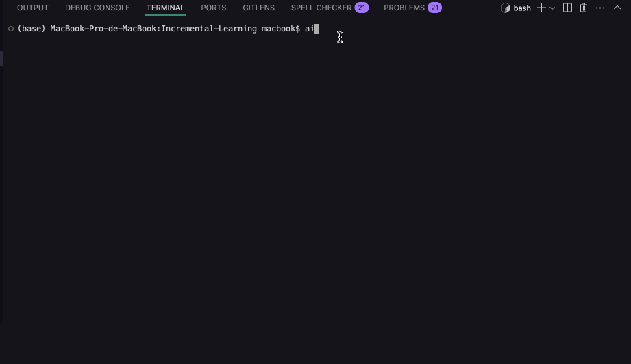
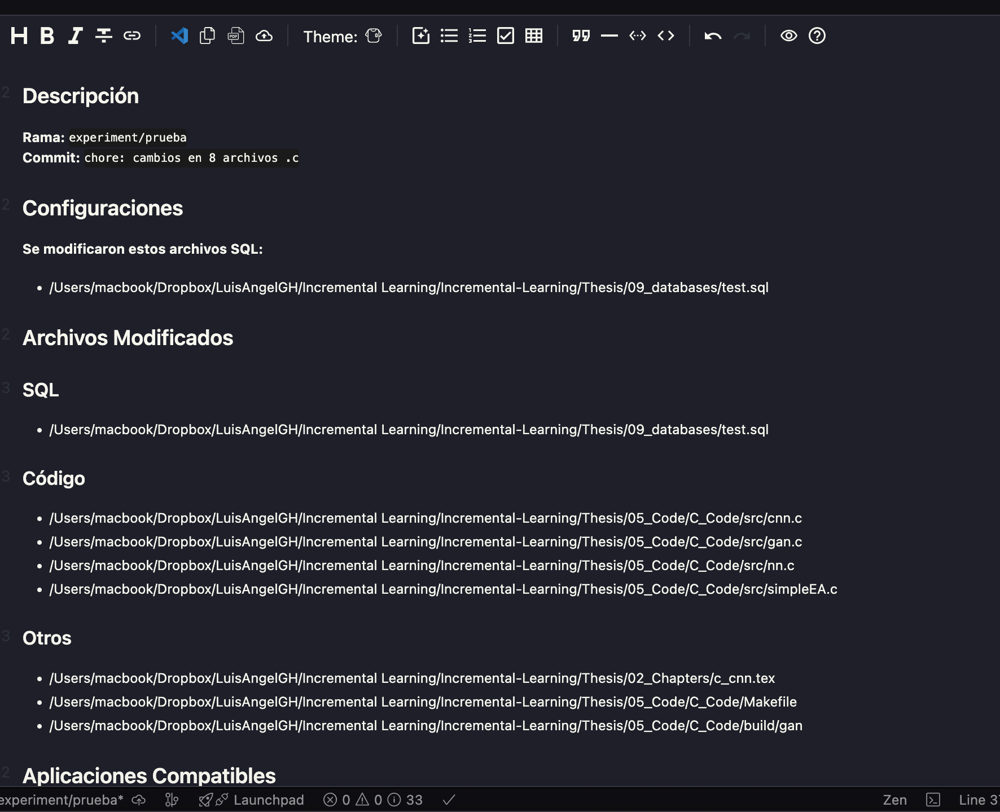
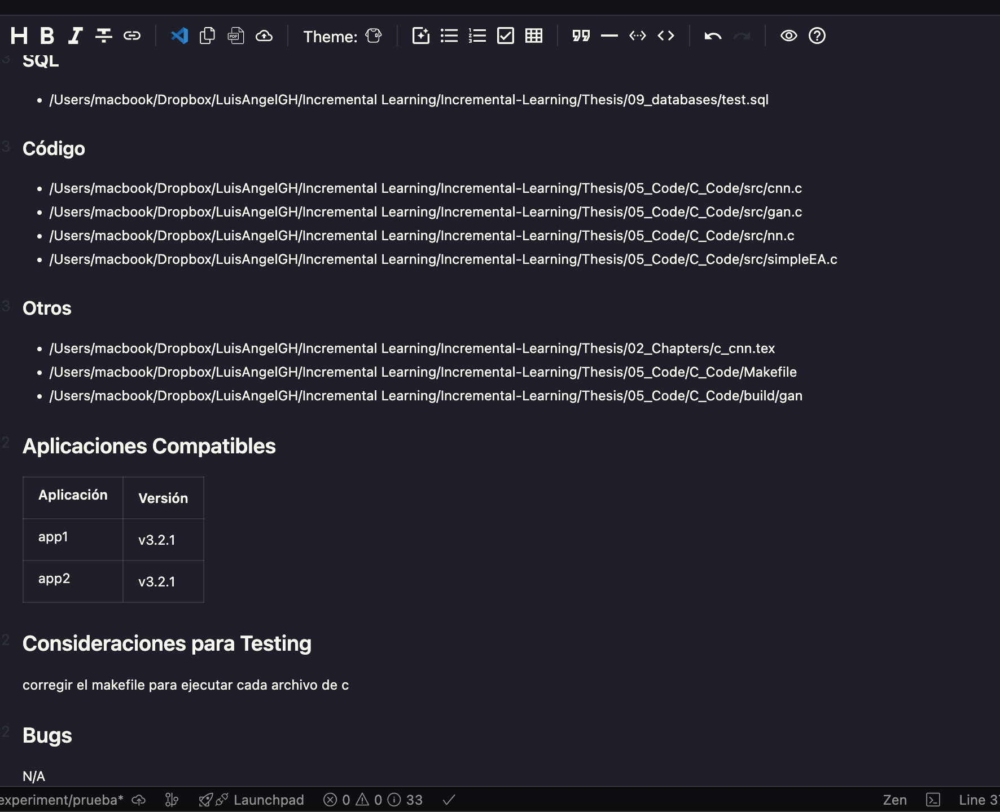

# AI Git Assistant 🤖📦

[](https://pypi.org/project/ai-git-assistant/)
[](https://file+.vscode-resource.vscode-cdn.net/Users/macbook/Documents/gitAssistant/LICENSE)

📄 This README is also available in: [Español](README.es.md)

Intelligent Git assistant that automates semantic commit creation and generates Pull Request templates, with support for change analysis and AI-based suggestions.

## ✨ Key Features

- 🧠 **Smart commit suggestions** using ML (Naive Bayes + TF-IDF)
- 📝 **Automatic message generation** with multiple approaches:
  - File type-based
  - Change-based
  - Code theme-based
- 🔍 **Automatic detection** of modified files (staged/unstaged/untracked)
- 📊 **Change analysis** by file type (code, docs, tests, etc.)
- 📑 **PR template** with:
  - Organized list of modified files
  - Testing considerations section
  - Compatible applications table
- 🛠️ **SQL support** with special .sql file detection
- 🌍 **Spanish interface** (easy to internationalize)

---

## 📦 Installation

```bash
pip install ai-git-assistant
```

Or install from source:

```bash
https://github.com/LuisGH28/git_assitant.git
cd git_assitant
pip install .
```

---


## 🎥 Demo

Animated Demo



Result of the suggestion for the PR





**Note:** you must be in the root of the project, as shown in the gif, if all your project is in the example folder in the terminal you must be located in the example and there you can run with the command ai-git-assistant

---


## 🏗️ Project Structure

```
ai-git-assistant/
├── __init__.py
├── __main__.py            # Main logic
├── requirements.txt       # Dependencies
tests/
├── tests_cli.py           # Interface tests
└── tests_git_utils.py     # Git functionality tests
```

---

## 📌 Requirements

* Python 3.8+
* Git installed and configured
* Dependencies:
  * scikit-learn
  * joblib

---

## 🛠️ Development

1. Clone the repository
2. Create a virtual environment:

```
python -m venv venv
source venv/bin/activate  # Linux/Mac
venv\Scripts\activate     # Windows
```

3. Install dependencies:

```
pip install -e ".[dev]"
```

4. Run tests:

```
pytest
```

---

## 🤖 Roadmap

* Support for more languages (i18n)
* Integration with GitHub/GitLab APIs
* Non-interactive mode for CI/CD
* Editor plugins (VSCode, PyCharm)

---

## 🎉 Available on PyPI!

```
pip install ai-git-assistant
```

```mermaid

flowchart LR
  %% Niveles principales
  subgraph CLI["CLI (entrypoint __main__)"]
    run["ai-git-assistant (comando)"]
    args["Args & Config (flags/env)"]
    run --> args
  end

  subgraph Core["Core / Orquestador"]
    detector["Detector de cambios<br/>(staged/unstaged/untracked)"]
    analyzer["Analizador de cambios<br/>(code/docs/tests/sql)"]
    strategies["Estrategias de mensajes"]
    prgen["Generador de Plantilla PR"]
    i18n["i18n (ES-ready)"]
  end

  subgraph ML["ML"]
    tfidf["TF-IDF Vectorizer"]
    nb["Naive Bayes<br/>(joblib model)"]
    tfidf --> nb
  end

  subgraph GitLayer["Capa Git / FS"]
    gitops["Operaciones Git<br/>(diff, status, files)"]
    fs["FileSystem utils"]
    sqlflag["Detector .sql<br/>(reglas especiales)"]
  end

  subgraph Output["Salidas"]
    commitMsg["Mensaje de commit<br/>(sugerido/auto)"]
    prTemplate["Plantilla de Pull Request"]
  end

  %% Flujos
  run --> detector
  args --> Core
  detector --> gitops
  gitops --> analyzer
  analyzer --> strategies
  analyzer --> sqlflag
  strategies --> nb
  strategies --> commitMsg
  nb --> commitMsg
  tfidf --> strategies

  analyzer --> prgen
  i18n --> strategies
  i18n --> prgen

  prgen --> prTemplate
  fs --> analyzer

  %% Estrategias internas
  subgraph STRAT["Estrategias de generación"]
    ftype["Por tipo de archivo"]
    change["Por cambios (diff)"]
    theme["Por tema de código"]
  end
  strategies --- STRAT
  STRAT --> commitMsg

